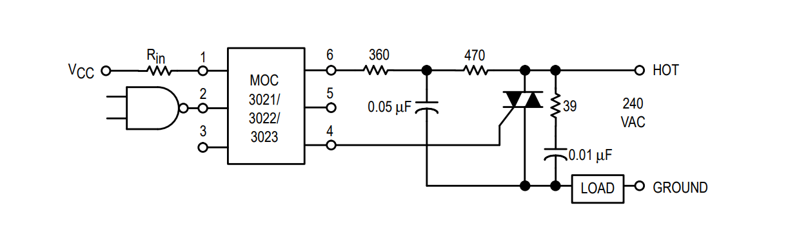
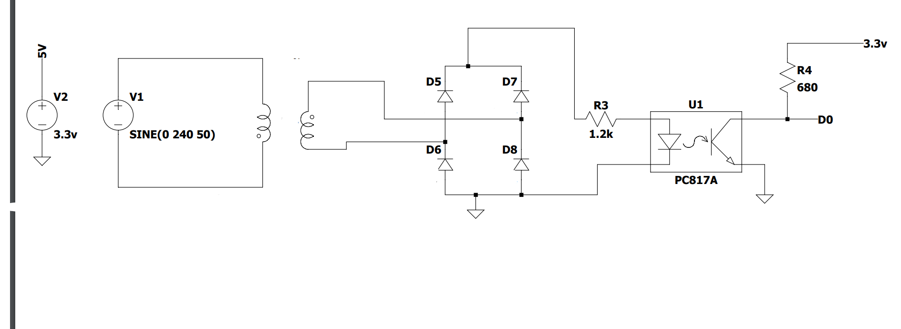
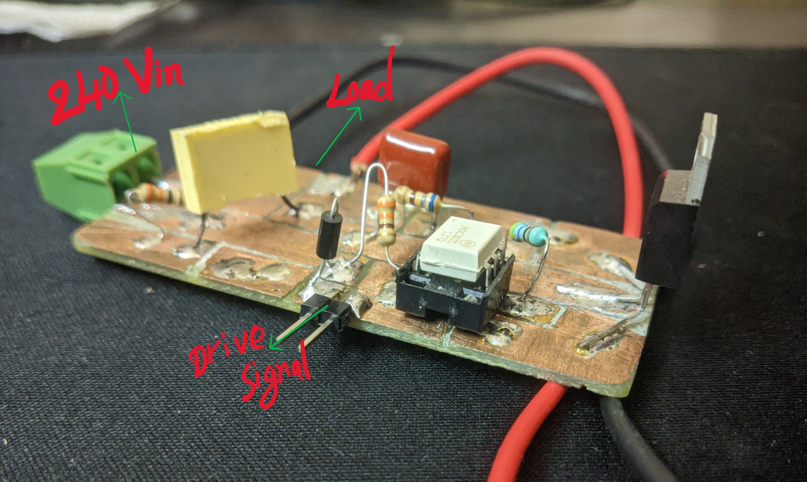
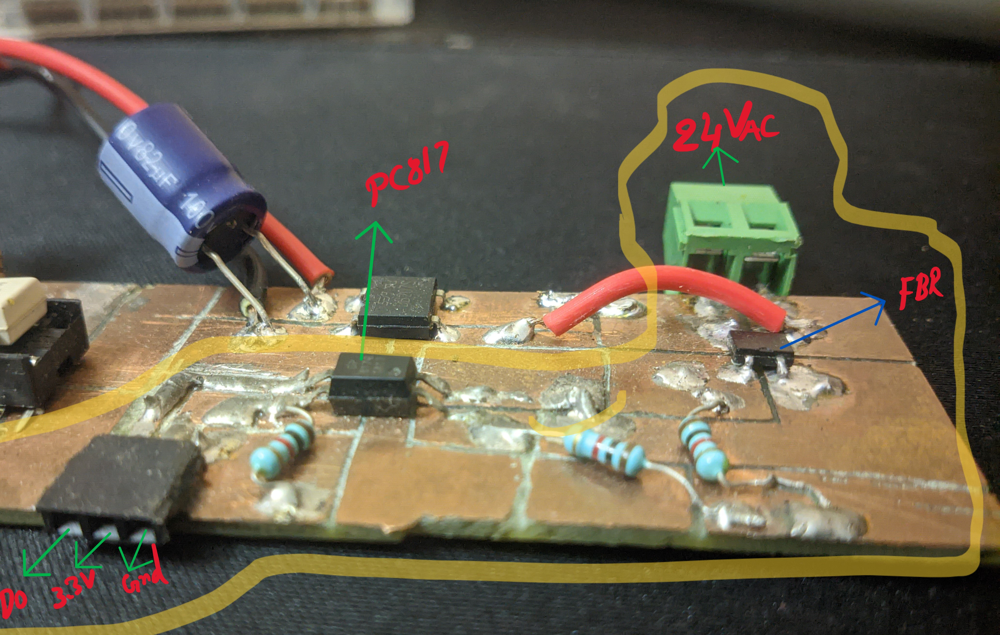

# Triac_control
This is a simple implementation of Phase angle control for a Triac. The code is written in Micropython and has been tested on a Pi Pico development board with RP2040 microcontroller.
The phase angle of the AC voltage applied across the load is controlled via an MOC3022 Triac optoisolator. The optoisolator features high surge isolation and thus protects the sensitive electronics if something goes wrong.

Before getting started, you should note that this involves working with mains voltage. I will assume that you know what you're doing. If you are new to circuits involving high voltages, be extra attentive and test your circuits using lower voltages (using a step-down transformer) before connecting to mains.

Pi Pico has an interrupt at GPIO 2, which is used to detect a zero-crossing pulse generated through a PC817 optocoupler. The mains AC signal is stepped down to 24V using a transformer and rectified using a full-bridge rectifier. The rectified output should not be filtered as we want to detect the peaks. Since the applied AC signal has a frequency of 50Hz, the rectified unfiltered output would have a frequency of 100Hz (the negative peaks of AC are shifted to a DC level). This voltage is fed to the optocoupler through a current-limiting resistor.

Choose the right value for the current-limiting resistor by referencing the optocoupler's datasheet. If your resistors seem to be a little hot (like mine), it's probably because the power dissipation at the resistor is quite high. The solution is to use a resistor with higher power dissipation. You can also use two resistors in series to divide the dissipation equally.

(Do note that there are other methods for zero-crossing detection. You can directly connect the optocoupler to mains using quite large value resistors, but I find this not so safe while working, so I will stick with this method.)

The Triac side of the circuit consists of an RC snubber circuit. This is not mandatory if you're using resistive loads like a heater but is essential if it's an inductive load. I will be adding this anyway since it doesn't hurt to have the feature. Since I'm working on a heater project, the snubber values are just the default ones stated in the MOC3022 datasheet. If you want to calculate exact values for your application, I would recommend watching [this](https://www.youtube.com/watch?v=wgNMepGIrTk&t=13s) YouTube video as a starter!

If your wondering which Triac I used, it is the classic [BTA16-600B](https://www.st.com/resource/en/datasheet/t1610.pdf).

## Triac and optoisolater schematic:

check out the [MOC3022](https://www.farnell.com/datasheets/97984.pdf) datasheet for more info.

## Zero crossing detector schematic:

## Prototypes on Copper clad:

***Power board with Isolated Triac Drive***

***Zero cross Detector and Triac Control Board***

If your prototyping/testing, try to implement both circuits on seperate boards.
This way you could isolate High voltage stuff and be extra safe. 

	
